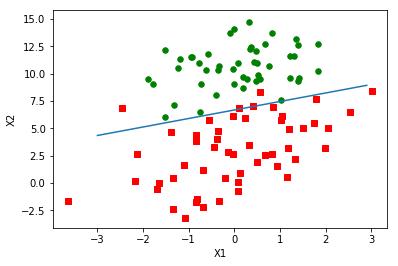
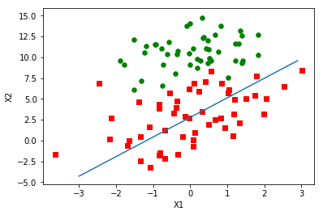
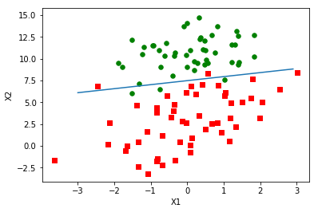

# Logistic 回归算法及Python实现

### **1. 前言**

本文将介绍机器学习算法中的Logistic回归分类算法并使用Python进行实现。会接触到**最优化算法**的相关学习。

### **2. 算法原理**

什么是回归？

简单来说，回归就是用一条线对N多个数据点进行拟合或者按照一定的规则来划分数据集，这个拟合的过程和划分的过程就叫做回归。

Logistic 回归分类算法就是对数据集建立回归模型，依照这个模型来进行分类。

最优化算法在此的作用：寻找最佳回归系数

### **3. 回归分类器的形式**

基本形式是用每一个特征乘以一个回归系数，然后把所有的结果进行相加。

这样算出的结果很多是连续的，不利于分类，所以可以将结果再代入**Sigmoid函数**中得到一些比较离散的结果。

Sigmod函数的表达式为:

<center>$\sigma(z)=\frac{1}{1+e^{-z}}$</center>

Sigmoid函数的形状如下：


这样计算的结果将会是**0-1**的值，将中间值0.5进行分类点，大于等于0.5的为一类，小于0.5的又为一类

在这个过程中，工作的重点在于，**如何寻找最优的回归系数**。

### **4. 如何确定最佳回归系数**

Sigmoid 函数的输入记作`z`，由下面公式得出

<center>$z=\omega_0x_0+\omega_1x_1+\omega_2x_2+\cdots+\omega_nx_n$</center>

采用向量的写法可以写成

<center>$z=\omega^Tx$</center>

表示将两个数值向量对应的元素全部相乘在进行相加得到`z`值。其中`x`是分类器输入的数据，向量$\omega$即为我们要找的最佳回归系数，为了寻找最佳回归系数，我们需要用到最优化理论的一些知识。

这里采用梯度上升算法（求最大值），求最小值使用梯度下降。我们将学习到如何使用该方法求得数据集的最佳参数。接下来，展示如何绘制梯度上升法产生的决策变截图，该图能将梯度上升法的分类效果可视化地呈现出来。最后，我们将学习随机梯度上升算法，以及如何对其进行修改以获得更好的效果。

#### **4.1 梯度上升算法**

梯度上升算法基于的思想是：要找到某函数的最大值，最好的办法就是沿着该函数的梯度方向探寻，如果梯度记为$\nabla$, 则函数$f(x,y)$的梯度由下式表示：

<center>$\nabla f(x,y) = \begin{pmatrix} \frac {\partial f(x,y)} {\partial x} \\ \frac {\partial f(x,y)} {\partial y} \\ \end{pmatrix}$</center>

这是机器学习中最容易造成混淆的一个地方，但在数学上并不难，需要做的只是牢记这些符号的含义。这个梯度意味着要沿`x`的方向移动$\frac {\partial f(x,y)} {\partial x}$, 沿`y`的方向移动$\frac{\partial f(x,y)}{\partial y}$。其中，函数$f(x,y)$必须要在待计算的点上有定义并且可微。一个具体的函数例子见下图。


图中的梯度上升算法沿梯度方向移动了一步。乐意看到，梯度算子总是指向函数值增长最快的方向。这里说到移动方向，而未提及移动量的大小。该量值称为步长，记作α。用向量来表示的话，梯度上升算法的迭代公式如下：

<center>$w: = w + \alpha \nabla_w f(w)$</center>

该公式将一直被迭代执行，直到达到某个停止条件为止，比如设定的迭代次数或者达到某个允许的误差范围。

吴恩达的machine learning第三周的课程中使用的是梯度下降算法，它的公式为：

<center>$w: = w - \alpha \nabla_w f(w)$</center>

我们可以看到，两个算法其实是一样的，只是公式中的加减法不同而已。梯度上升算法用来求函数的最大值，而梯度下降算法用来求函数的最小值。

**梯度上升的伪代码**

```
每个回归系数初始化为1
重复R次:
	计算整个数据集的梯度
	使用alpha下的gradient更新回归系数的向量
返回回归系数
```

**Python实现**

```python
#! /usr/bin/env python
# -*- coding: utf-8 -*-
"""
实现logistic回归分类算法， 数据集为: dataset.csv
"""

import numpy as np
import matplotlib.pyplot as plt

def loadDataSet():
   """
   加载数据集
   return: 数据列表， 标签列表
   """
   dataMat = []
   labelMat = []
   #打开数据集
   fr = open('dataset.csv')
   #遍历每一行
   for line in fr.readlines():
        #删除空白符之后进行切分
        lineArr = line.strip().split(',')
        #数据加入数据列表
        dataMat.append([1.0, float(lineArr[0]), float(lineArr[1])])
        #标签加入数据列表
        labelMat.append(int(lineArr[2]))
        #返回数据列表和标签列表
   return dataMat, labelMat
    
def sigmoid(inX):
    """
    计算sigmoid函数
    @: param intX: 矩阵计算的结果(100x1)
    @: return: 计算结果
    """
    return 1.0 / (1 + np.exp(-inX))
        
def gradAscent(dataMat, labelMat):
    """
    梯度上升函数
    @: param dataMat: 数据集
    @: param labelMat: 标签集
    @： return: 权重参数矩阵(最佳回归系数)
    """
    # 将数据转为numpy的数组
    dataMatrix = np.mat(dataMat)
    labelMat = np.mat(labelMat).transpose()
    # 获取矩阵的行列数
    m, n = np.shape(dataMatrix)
    # 初始化参数
    alpha = 0.001
    # 初始化迭代次数
    maxCyc = 500
    # 初始化矩阵的权重参数矩阵， 均为1
    weights = np.ones((n, 1))
    # 开始迭代计算
    for k in range(maxCyc):
        h = sigmoid(dataMatrix * weights)
        # 计算误差
        error = labelMat-h
        # 更新迭代参数
        weights = weights + alpha * dataMatrix.transpose() * error
    return weights

def plotBestFit(weights):
    #导入数据
    dataMat, labelMat = loadDataSet()
    #创建数组
    dataArr = np.array(dataMat)
    #获取数组行数
    n = np.shape(dataArr)[0]
    #初始化坐标
    xcord1 = []; ycord1 = []
    xcord2 = []; ycord2 = []
    #遍历每一行数据
    for i in range(n):
        #如果对应的类别标签对应数值1，就添加到xcord1，ycord1中
        if int(labelMat[i]) == 1:
            xcord1.append(dataArr[i,1]); ycord1.append(dataArr[i,2])
        #如果对应的类别标签对应数值0，就添加到xcord2，ycord2中
        else:
            xcord2.append(dataArr[i,1]); ycord2.append(dataArr[i,2])
    #创建空图
    fig = plt.figure()
    #添加subplot，三种数据都画在一张图上
    ax = fig.add_subplot(111)
    #1类用红色标识，marker='s'形状为正方形
    ax.scatter(xcord1, ycord1, s=30, c='red', marker='s')
    #0类用绿色标识，弄认marker='o'为圆形
    ax.scatter(xcord2, ycord2, s=30, c='green')
    #设置x取值，arange支持浮点型
    x = np.arange(-3.0, 3.0, 0.1)
    #配计算y的值
    y = (-weights[0]-weights[1]*x)/weights[2]
    #画拟合直线
    ax.plot(x, y)
    #贴坐标表头
    plt.xlabel('X1'); plt.ylabel('X2')
    #显示结果
    plt.show()

if __name__ == '__main__':
    dataArr, labelMat = loadDataSet()
    weights = gradAscent(dataArr, labelMat)
    print (weights)
    plotBestFit(weights.getA())
```

得到图像:



这个分类效果相当不错，从图上看之分错了两到四个点。但是，尽管例子简单并且数据集很小，这个方法却很需要大量的计算（300次乘积）。下面我们将对该算法进行改进，从而使它可以用到真实数据上。

#### **4.2. 随机梯度上升**

梯度上升算法在每次更新回归系数时都需要遍历整个数据集，计算复杂度太高了。一种改进方法就是一次仅用一个样本点来更新回归系数，该方法称为随机梯度上升算法。由于可以在新样本到来时对分类器进行增量式更新，因而随机梯度上升算法是一个在线学习方法。与“在线学习”相对应的，一次处理所有数据被称为是“批处理”

**伪代码：**

```
所有回归系数初始化为1
对数据集中每个样本
    计算该样本的梯度
    使用alpha * gradient 更新回归系数值
返回回归系数值
```

**Python实现**

```python
def randomGradAscent(dataMat, labelMat):
    """
    随机梯度上升函数
    @: param dataMat: 数据集
    @: param labelMat: 标签集
    @： return: 权重参数矩阵(最佳回归系数)
    """
    dataMatrix = np.array(dataMat)
    m, n = np.shape(dataMatrix)
    # 设置步长
    alpha = 0.01
    #初始化参数
    weights = np.ones(n)
    for i in range(m):
        h = sigmoid(sum(dataMatrix[i]*weights))
        # 计算误差
        error = labelMat[i]-h
        # 更新权重矩阵
        weights = weights + alpha * error * dataMatrix[i]
    return weights
```

**得到下图：**



#### **4.3. 改进的随机梯度上升算法**

**改进：**

- alpha在每次迭代的时候都会调整，这会缓解上一张图中的数据高频波动。另外，虽然alpha会随着迭代次数不断减小，但永远不会减小到0，这是因为alpha更新公式中存在一个常数项，必须这样做的原因是为了保证在多次迭代之后新数据仍然具有一定得影响。如果要处理的问题是动态变化的，那么可以适当加大上述常数项，来确保新的值获得更大的回归系数。另一点值得注意的是，在降低alpha的函数中，alpha每次减少$\frac{i}{j+i}$时，alpha就不是严格下降的。便面参数的严格下降也常见于模拟退火算法等其他优化算法中。
- 另一方面，通过随机选取样本来更新回归系数，可以减少周期性的波动。

**Python实现**

```python
def randomGradAscent2(dataMat, labelMat):
    """
    改进的随机梯度上升算法
    """
    dataMatrix = np.array(dataMat)
    m, n = np.shape(dataMatrix)
    # 初始化参数
    weights = np.ones(n)
    # 迭代次数
    numIter = 500
    for i in range(numIter):
        # 初始化index列表，这里要注意将range输出转换成list
        dataIndex = list(range(m))
        # 遍历每一行数据，这里要注意将range输出转换成list
        for j in list(range(m)):
            # 更新alpha值，缓解数据高频波动
            alpha = 4/(1.0+i+j)+0.0001
            # 随机生成序列号，从而减少随机性的波动
            randIndex = int(np.random.uniform(0, len(dataIndex)))
            # 序列号对应的元素与权重矩阵相乘，求和后再求sigmoid
            h = sigmoid(sum(dataMatrix[randIndex]*weights))
            # 求误差，和之前一样的操作
            error = labelMat[randIndex] - h
            # 更新权重矩阵
            weights = weights + alpha * error * dataMatrix[randIndex]
            # 删除这次计算的数据
            del(dataIndex[randIndex])
    return weights
```

得到下图：



### **5. 实战- 从疝气病症预测病马的死亡率**

#### **5.1. 步骤**

- 收集数据
- 处理数据
- 分析数据
- 训练算法
- 测试算法

#### **5.2. 准备数据**

该实例使用Logistic回归来预测患有疝病的马的存活问题。这里的数据来自2010年1月11日的UCI机器学习数据库，其中包含**368**个样本和**28**个特征。**这里的数据集是有30%的数据缺失的**

[UCI数据下载](http://archive.ics.uci.edu/ml/machine-learning-databases/horse-colic)

[也可以在我的Github进行下载](https://github.com/yingzk/MyML)

##### **5.2.1. 处理数据集中缺失的数据**

我们有以下方法处理缺失数据：

- 使用可用特征的均值来填补缺失值；
- 使用特殊值来填补缺失值，如-1；
- 忽略有缺失值的样本；
- 使用相似样本的均值来填补缺失值；
- 使用另外的机器学习算法预测缺失值；
- 对于类别标签丢失的数据，只能将该数据丢弃。

由于这里缺失数据占到30%， 我们采用用特殊值来填补缺失值，特殊值为**0**

对于标签丢失的数据，我们选择舍去

##### **5.2.2. 测试算法**

基于上文，我们使用改进的随机梯度上升算法来进行测试

**Python实现**

```python
#! /usr/bin/env python
# -*- coding: utf-8 -*-

import numpy as np
import logistic

def classifyVector(inX, weights):
    """
    分类
    """
    prob = logistic.sigmoid(sum(inX * weights))
    if prob > 0.5:
        return 1.0
    else:
        return 0.0

def colicTest():
    """
    训练和测试模型
    """
    frTrain = open('horse_colic_train.txt')
    frTest = open('horse_colic_test.txt')
    trainingSet = []
    trainingLabels = []
    # --------------训练------------------
    for line in frTrain.readlines():
        currLine = line.strip().split('\t')
        lineArr =[]
        for i in range(21):
            lineArr.append(float(currLine[i]))
        trainingSet.append(lineArr)
        trainingLabels.append(float(currLine[21]))
    trainWeights = logistic.randomGradAscent2(np.array(trainingSet), trainingLabels)
    
    # --------------测试------------------
    numTestVec = 0.0
    errorCount = 0
    for line in frTest.readlines():
        numTestVec += 1.0
        currLine = line.strip().split('\t')
        lineArr =[]
        for i in range(21):
            lineArr.append(float(currLine[i]))
        if int(classifyVector(np.array(lineArr), trainWeights))!= int(currLine[21]):
            errorCount += 1
    errorRate = (float(errorCount)/numTestVec)
    print ("测试的错误率为: %f" % errorRate)
    return errorRate
      
def multiTest():
    """
    多次测试
    """
    numTests = 10 
    errorSum = 0.0
    for k in range(numTests):
        errorSum += colicTest()
    print ("第 %d 次迭代后，错误率为: %f" % (numTests, errorSum / float(numTests)))
  
if __name__ == '__main__':
    multiTest()
```

最终结果：

```python
测试的错误率为: 0.417910
测试的错误率为: 0.328358
测试的错误率为: 0.417910
测试的错误率为: 0.268657
测试的错误率为: 0.313433
测试的错误率为: 0.388060
测试的错误率为: 0.417910
测试的错误率为: 0.358209
测试的错误率为: 0.343284
测试的错误率为: 0.298507
第 10 次迭代后，错误率为: 0.355224
```


参考:

http://blog.csdn.net/u011475210/article/details/78012796?locationNum=1&fps=1