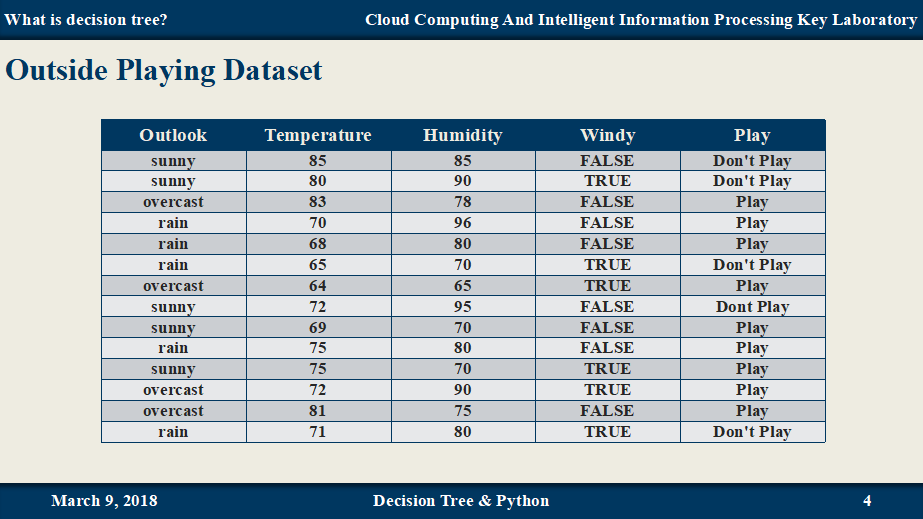
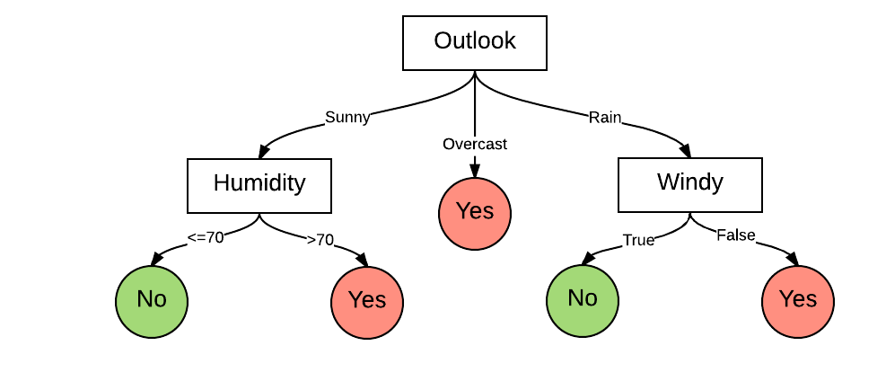
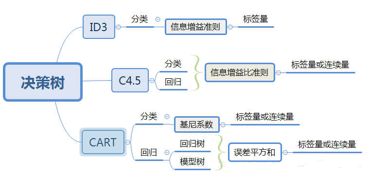

# 三种决策树算法（ID3, CART, C4.5）及Python实现

### **1. 决策树(Decision Tree)简介**

#### **1.1. 决策树的原理**

决策树是属于机器学习监督学习分类算法中比较简单的一种，决策树是一个预测模型；他代表的是对象属性与对象值之间的一种映射关系。树中每个节点表示某个对象，而每个分叉路径则代表的某个可能的属性值，而每个叶结点则对应从根节点到该叶节点所经历的路径所表示的对象的值。决策树仅有单一输出，若欲有复数输出，可以建立独立的决策树以处理不同输出。 是通过一系列规则对数据进行分类的过程。

**示例： 一个周末是否出去玩的例子**



决策树即是将数据集转换成树形的结构，如下:



#### **1.2. 决策树的构造过程**

一般包含三个部分
​         1、特征选择：特征选择是指从训练数据中众多的特征中选择一个特征作为当前节点的分裂标准，如何选择特征有着很多不同量化评估标准标准，从而衍生出不同的决策树算法，如CART, ID3, C4.5等。
​          2、决策树生成： 根据选择的特征评估标准，从上至下递归地生成子节点，直到数据集不可分则停止决策树停止生长。 树结构来说，递归结构是最容易理解的方式。
​         3、剪枝：决策树容易过拟合，一般来需要剪枝，缩小树结构规模、缓解过拟合。剪枝技术有**预剪枝**和**后剪枝**两种。

**伪代码**

```
if 遇到终止条件:
	return 类标签
else:
	寻找一个最优特征对数据集进行分类
	创建分支点
	对每个分支节点进行划分，将分支点返回到主分支
	return 分支节点
```

#### **1.3. 决策树的优缺点**

决策树适用于数值型和标称型（离散型数据，变量的结果只在有限目标集中取值），能够读取数据集合，提取一些列数据中蕴含的规则。在分类问题中使用决策树模型有很多的优点，决策树计算复杂度不高、便于使用、而且高效，决策树可处理具有不相关特征的数据、可很容易地构造出易于理解的规则，而规则通常易于解释和理解。决策树模型也有一些缺点，比如处理缺失数据时的困难、过拟合以及忽略数据集中属性之间的相关性等。

#### **1.4. 三种决策树算法简介**

决策树算法中的核心部分即是：**如何选择划分属性？**

最早的决策树算法起源于CLS(Concept Learning System)系统，即概念学习系统。

这就必须采用量化的方法来进行判断，量化的方法有很多，其中一项就是通过"**信息论度量信息分类**"。基于信息论的决策树算法有：ID3,  CART,  C4.5等算法。

ID3 算法是由Ross Quinlan发明的，建立在“奥卡姆剃刀”的基础上，越简单的决策树越优于越大的决策树（Be Simple），ID3算法中，根据信息论的信息增益来进行评估和特征的选择，每次选择**信息增益最大**的特征作为判断模块。ID3算法可以用于划分标称型数据集，没有剪枝的过程，为了去除过度数据匹配的问题，可通过裁剪合并相邻的无法产生大量信息增益的叶子节点（例如设置信息增益阀值）。使用信息增益的话其实是有一个缺点，那就是它偏向于具有大量值的属性–就是说在训练集中，某个属性所取的不同值的个数越多，那么越有可能拿它来作为分裂属性，而这样做有时候是没有意义的，另外ID3不能处理连续分布的数据特征，于是就有了C4.5算法（目前也出现了C5.0算法 商业版）。CART算法也支持连续分布的数据特征。

C4.5是ID3的一个改进算法，继承了ID3算法的优点。**C4.5算法用信息增益率来选择划分属性**，克服了用信息增益选择属性时偏向选择取值多的属性的不足在树构造过程中进行剪枝；能够完成对连续属性的离散化处理；能够对不完整数据进行处理。C4.5算法产生的分类规则易于理解、准确率较高；但效率低，因树构造过程中，需要对数据集进行多次的顺序扫描和排序。也是因为必须多次数据集扫描，C4.5只适合于能够驻留于内存的数据集。

CART算法的全称是Classification And Regression Tree，采用的是Gini指数（选Gini指数最小的特征s）作为分裂标准,同时它也是包含后剪枝操作。ID3算法和C4.5算法虽然在对训练样本集的学习中可以尽可能多地挖掘信息，但其生成的决策树分支较大，规模较大。为了简化决策树的规模，提高生成决策树的效率，就出现了根据GINI系数来选择测试属性的决策树算法CART。



熵：度量随机变量的不确定性。（纯度）

（1）信息熵

在概率论中，信息熵给了我们一种度量不确定性的方式，是用来衡量随机变量不确定性的，熵就是信息的期望值。若待分类的事物可能划分在N类中，分别是$x_1,x_2,\cdots,x_n$，每一种取到的概率分别是$p_1,p_2,\cdots,p_n$，那么数据集D的熵就定义为：

$H(D)=-\sum^{|n|}_{i=1}p_ilogp_i$

从定义中可知:$0≤H(D)≤log(n)$

当随机变量只取两个值时，即D的分布为$P(D=1)=p, P(D=0)=1-p, 0≤p≤1$则熵为:$H(D)=−plog_2p−(1−p)log_2(1−p)$。

熵值越高，则数据混合的种类越高，其蕴含的含义是一个变量可能的变化越多（反而跟变量具体的取值没有任何关系，只和值的种类多少以及发生概率有关），它携带的信息量就越大。

（2）条件熵

假设有随机变量$(X,Y)$，其联合概分布为:

$P(X=x_i,Y=y_i)=p_{ij}, i=1,2,⋯,n;j=1,2,⋯,m$则条件熵$H(Y∣X)$表示在已知随机变量X的条件下随机变量Y的不确定性，其定义为X在给定条件下Y的条件概率分布的熵对X的数学期望:

$H(Y|X)=\sum^{n}_{i=1}p_iH(Y|X=x_i)$

（3）信息增益

信息增益(information gain)表示得知特征X的信息后，而使得Y的不确定性减少的程度。定义为:

$Gain(D,A)=H(D)-H(D|A)$

（4）Gini 指数

基尼指数（基尼不纯度）：表示在样本集合中一个随机选中的样本被分错的概率。

 **注意**： Gini指数越小表示集合中被选中的样本被分错的概率越小，也就是说集合的纯度越高，反之，集合越不纯。

即 **基尼指数（基尼不纯度）= 样本被选中的概率 \* 样本被分错的概率**

$Gini(p)=\sum^{|y|}_{k=1}\sum_{k'}p_kp^{'}_k = 1- \sum^{|y|}_{k=1}p^2_k$


### **2. ID3的Python实现**

```python
#!/usr/bin/env python
# -*- coding: utf-8 -*-

import numpy as np
import pandas as pd
import operator

def loadDataSet():
    """
    导入数据
    @ return dataSet: 读取的数据集
    """
    # 对数据进行处理
    dataSet = pd.read_csv('isFish.csv', delimiter=',')
    # dataSet = dataSet.replace('yes', 1).replace('no', 0)
    labelSet = list(dataSet.columns.values)
    dataSet = dataSet.values
    return dataSet, labelSet

def calcShannonEnt(dataSet):
    """
    计算给定数据集的信息熵（香农熵）
    @ param dataSet: 数据集
    @ return shannonEnt: 香农熵
    """
    numEntries = len(dataSet)
    labelCounts = {}
    for featVec in dataSet:
        # 当前样本类型
        currentLabel = featVec[-1]
        # 如果当前类别不在labelCounts里面，则创建
        if currentLabel not in labelCounts.keys():
            labelCounts[currentLabel] = 0
        labelCounts[currentLabel] += 1
    shannonEnt = 0.0
    for key in labelCounts:
        prob = float(labelCounts[key]) / numEntries
        shannonEnt -= prob*np.log2(prob)
    return shannonEnt

def splitDataSet(dataSet, axis, value):
    """
    划分数据集, 提取所有满足一个特征的值
    @ param dataSet: 数据集
    @ param axis: 划分数据集的特征
    @ param value: 提取出来满足某特征的list
    """
    retDataSet = []
    for featVec in dataSet:
        # 将相同数据特征的提取出来
        if featVec[axis] == value:
            reducedFeatVec = list(featVec[:axis])
            reducedFeatVec.extend(featVec[axis+1:])
            retDataSet.append(reducedFeatVec)
    return retDataSet

def chooseBestFeature(dataSet):
    """
    选择最优的划分属性
    @ param dataSet: 数据集
    @ return bestFeature: 最佳划分属性
    """
    # 属性的个数
    numFeature = len(dataSet[0])-1
    baseEntroy = calcShannonEnt(dataSet)
    bestInfoGain = 0.0
    bestFeature = -1
    for i in range(numFeature):
        # 获取第i个特征所有可能的取值
        featureList = [example[i] for example in dataSet]
        # 去除重复值
        uniqueVals = set(featureList)
        newEntropy = 0.0
        for value in uniqueVals:
            subDataSet = splitDataSet(dataSet, i, value)
            # 特征为i的数据集占总数的比例
            prob = len(subDataSet) / float(len(dataSet))
            newEntropy += prob * np.log2(prob)
        inforGain = baseEntroy - newEntropy
        
        if inforGain > bestInfoGain:
            bestInfoGain = inforGain
            bestFeature = i
    return bestFeature

def majorityCnt(classList):
    """
    递归构建决策树
    @ param classList: 类别列表
    @ return sortedClassCount[0][0]: 出现次数最多的类别
    """
    classCount = {}
    for vote in classList:
        if vote not in classCount.keys():
            classCount[vote] = 0
        classCount += 1
    # 排序
    sortedClassCount = sorted(classCount.items(), key=operator.itemgetter(1), reverse=True)
    # 返回出现次数最多的
    return sortedClassCount[0][0]

def createTree(dataSet, labels):
    """
    构造决策树
    @ param dataSet: 数据集
    @ param labels: 标签集
    @ return myTree: 决策树
    """
    classList = [example[-1] for example in dataSet]
    # 当类别与属性完全相同时停止
    if classList.count(classList[0]) == len(classList):
        return classList[0]
    # 遍历完所有特征值时，返回数量最多的
    if (len(dataSet[0]) == 1):
        return majorityCnt(classList)
    
    # 获取最佳划分属性
    bestFeat = chooseBestFeature(dataSet)
    bestFeatLabel = labels[bestFeat]
    myTree = {bestFeatLabel:{}}
    # 清空labels[bestFeat]
    del(labels[bestFeat])
    featValues = [example[bestFeat] for example in dataSet]
    uniqueVals = set(featValues)
    for value in uniqueVals:
        subLabels = labels[:]
        # 递归调用创建决策树
        myTree[bestFeatLabel][value] = createTree(splitDataSet(dataSet, bestFeat, value), subLabels)
    return myTree
    

if __name__ == '__main__':
    dataSet, labelSet = loadDataSet()
    shannonEnt = calcShannonEnt(dataSet)
    tree= createTree(dataSet, labelSet)
    print (tree)
```


其余算法待补充...