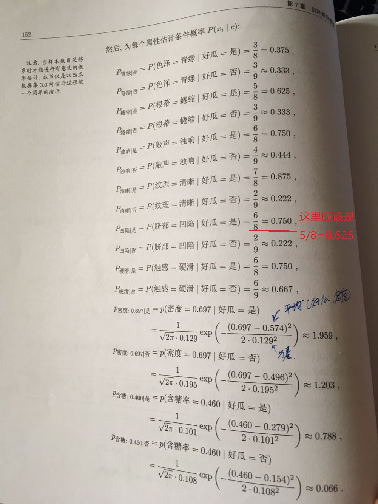
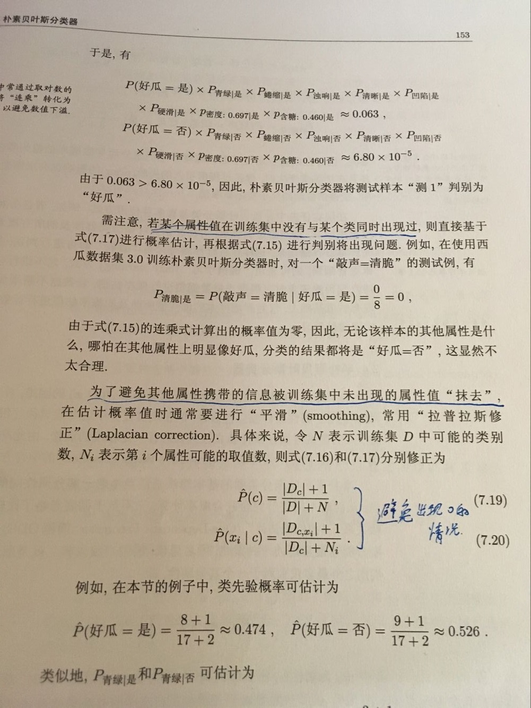
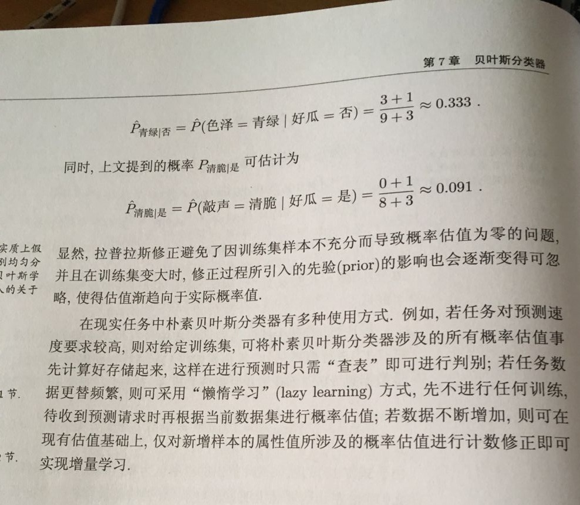

# 贝叶斯分类器及Python实现

### **0. 前言**

贝叶斯分类是一类分类算法的总称，这类算法均以贝叶斯定理为基础，故统称为贝叶斯分类。本文由本人学习贝叶斯分类器过程中的笔记，再加上使用Python进行文本分类实战组成。

### **1. 贝叶斯决策论（Bayesian decision theory）**

贝叶斯决策论是概率框架下实施决策的基本方法。对于分类任务来说，在所有相关概率都已知的情况下，贝叶斯决策论考虑如何基于这些概率和误判损失来选择最优的类别标记。

假设由N种可能的类别标记，$\mathcal{Y}={c_1,c_2,\cdots,c_N}$,$\lambda_{ij}$是将一个真实标记为$c_j$的样本误差分类为$c_i$所产生的损失，基于后验概率$P(c_i|\boldsymbol{x})$可获得将样本$\boldsymbol{x}$分类为$c_i$所产生的期望损失(expected loss)，即在样本$\boldsymbol{x}$上的“条件风险”(conditional risk)

$R(c_i|\boldsymbol{x})=\sum^{N}_{j=1}\lambda_{ij}P(c_j|\boldsymbol{x})$

主要任务是寻找一个判定准则$h: \mathcal{X\mapsto Y}$以最小化总体风险

$R(h)=\mathbb{E}_x[R(h(\boldsymbol{x})|\boldsymbol{x})]$

显然，对每个样本$\boldsymbol x$,若$h$能最小化条件风险$R(h(\boldsymbol{x})|\boldsymbol x)$,则总体风险$R(h)$也将被最小化

由此产生了贝叶斯准则(Bayes decision rule): 

**为最小化总体风险，只需在每个样本上选择那个能使条件风险$R(c|\boldsymbol x)$最小的类别标记**

$h^*(\boldsymbol x)=\underset{c \in \mathcal{Y}}{argmin}R(c|\boldsymbol(x))$

此时，$h^*(\boldsymbol x)$称为贝叶斯最优分类器（Bayse optimal classifier），与之对应的总体风险$R(h^*)$称为贝叶斯风险（Bayes risk）. $1-R(h^*)$反映了分类器所能达到的最好性能。

若目标是最小化分类错误率，则误判损失$\lambda_{ij}$可写为

$\lambda_{ij}=\begin{cases}0, \quad\mathrm{if}\quad i == j \\ 1, \quad otherwise\end{cases}$

此时风险条件为：

$R(c|\boldsymbol x)=1-P(c|\boldsymbol x)$

最小化分类错误率的贝叶斯最优分类器为

$h^*(\boldsymbol x)=\underset{c \in \mathcal Y}{argmax}P(c|\boldsymbol x)$

基于贝叶斯定理，$P(c|\boldsymbol x)=\frac{P(c)P(\boldsymbol x|c)}{P(\boldsymbol x)}$

关于这个公式的证明，很容易，依照条件概率的定义即可得到，感兴趣的读者可以百度一下。这个定理虽然很简单，但是却建立起先验概率和后验概率相互转化的桥梁。 

$P(c)$为类先验概率

$P(\boldsymbol x|c)$称为类条件概率或者似然

> * 先验概率： 根据以往经验和分析得到的概率。
> * 后验概率：后验概率是基于新的信息，修正原来的先验概率后所获得的更接近实际情况的概率估计。

对于类先验概率就是样本空间中各类样本所占的比例，根据大数定理（当样本足够多时，频率趋于稳定等于其概率），这样当训练样本充足时，$P(c)$可以使用各类出现的频率来代替。因此只剩下类条件概率$P(\boldsymbol x|c)$,它表达的意思是在类别c中出现x的概率，它涉及到属性的联合概率问题，若只有一个离散属性还好，当属性多时采用频率估计起来就十分困难，因此这里一般采用极大似然法进行估计。

###2. 极大似然估计

极大似然估计（Maximum Likelihood Estimation，简称MLE），是一种根据数据采样来估计概率分布的经典方法。常用的策略是先假定总体具有某种确定的概率分布，再基于训练样本对概率分布的参数进行估计。运用到类条件概率$p(\boldsymbol x | c) $中，假设$p(\boldsymbol x | c )$服从一个参数为θ的分布，问题就变为根据已知的训练样本来估计$\theta$。极大似然法的核心思想就是：估计出的参数使得已知样本出现的概率最大，即使得训练数据的似然最大。

令$D_c$表示训练集$D$中第$c$类样本组成的集合，假设这些样本是独立同分布的，则参数$\boldsymbol \theta_c$对数据集$D_c$的似然是

$P(D_c|\boldsymbol \theta_c)=\underset{\boldsymbol x\in D_c}{\prod}P(\boldsymbol x|\boldsymbol \theta_c)$

对$\boldsymbol \theta_c$进行极大似然估计，就是去寻找能最大似然$P(D_c|\boldsymbol \theta_c)$的参数值$\hat{{\boldsymbol \theta_c}}$. 直观上看，极大似然估计是视图在$\boldsymbol \theta_c$所有可能取值中，找到一个能使数据出现的“可能性”最大的值

连乘操作使得求解变得复杂（容易造成下溢），一般我们使用对数似然(log-likelihood)

$LL(\boldsymbol \theta_c)=logP(D_c|\boldsymbol\theta_c)=\underset{\boldsymbol x\in D_c}{\sum}logP(\boldsymbol x| \boldsymbol\theta_c)$

此时参数$\boldsymbol \theta_c$的极大似然估计$\hat {\boldsymbol \theta_c}$为

$\hat {\boldsymbol \theta_c}=\underset{\boldsymbol \theta_c}{argmax}LL(\boldsymbol \theta_c)$

所以，贝叶斯分类器的训练过程就是参数估计。总结最大似然法估计参数的过程，一般分为以下四个步骤：

> * 1.写出似然函数；
> * 2.对似然函数取对数，并整理；
> * 3.求导数，令偏导数为0，得到似然方程组；
> * 4.解似然方程组，得到所有参数即为所求。

#### 3. 朴素贝叶斯分类器

朴素贝叶斯分类是一种十分简单的分类算法，叫它朴素贝叶斯分类是因为这种方法的思想真的很朴素，朴素贝叶斯的思想基础是这样的：对于给出的待分类项，求解在此项出现的条件下各个类别出现的概率，哪个最大，就认为此待分类项属于哪个类别。通俗来说，就好比这么个道理，你在街上看到一个黑人，我问你你猜这哥们哪里来的，你十有八九猜非洲。为什么呢？因为黑人中非洲人的比率最高，当然人家也可能是美洲人或亚洲人，但在没有其它可用信息下，我们会选择条件概率最大的类别，这就是朴素贝叶斯的思想基础。

基于属性条件独立性假设，可以得到

$P(c|\boldsymbol x)=\frac{P(c)P(\boldsymbol x|c)}{P(\boldsymbol x)}=\frac{P(c)}{P(\boldsymbol x)}\prod^d_{i=1}P(x_i|c)$

$d$为属性数目, $x_i$为$\boldsymbol x$在第$i$个属性上的取值

$h_{nb}(\boldsymbol x)=\underset{c\in \mathcal{Y}}{argmax}P(c)\prod^d_{i=1}P(x_i|c)$

这就是朴素贝叶斯的表达式

这样，为每个样本估计类条件概率变成为每个样本的每个属性估计类条件概率。


对于**离散属性** ，属性的条件概率可以估计为： $P(x_i|c)=\frac{|D_{c,x_i}|}{|D_c|}$

对于**连续属性**， 若假设属性服从正态分布，则条件概率可以估计为：

$p(x_i|c)=\frac{1}{\sqrt{2\pi}\sigma_{c,i}}exp(-\frac{(x_i-\mu_{}c,i)^2}{2\sigma^2_{c,i}})$


##### 实例

这里用西瓜数据集3.0为例

--《周志华-西瓜书》

```
编号,色泽,根蒂,敲声,纹理,脐部,触感,密度,含糖率,好瓜  
1,青绿,蜷缩,浊响,清晰,凹陷,硬滑,0.697,0.46,是  
2,乌黑,蜷缩,沉闷,清晰,凹陷,硬滑,0.774,0.376,是  
3,乌黑,蜷缩,浊响,清晰,凹陷,硬滑,0.634,0.264,是  
4,青绿,蜷缩,沉闷,清晰,凹陷,硬滑,0.608,0.318,是  
5,浅白,蜷缩,浊响,清晰,凹陷,硬滑,0.556,0.215,是  
6,青绿,稍蜷,浊响,清晰,稍凹,软粘,0.403,0.237,是  
7,乌黑,稍蜷,浊响,稍糊,稍凹,软粘,0.481,0.149,是  
8,乌黑,稍蜷,浊响,清晰,稍凹,硬滑,0.437,0.211,是  
9,乌黑,稍蜷,沉闷,稍糊,稍凹,硬滑,0.666,0.091,否  
10,青绿,硬挺,清脆,清晰,平坦,软粘,0.243,0.267,否  
11,浅白,硬挺,清脆,模糊,平坦,硬滑,0.245,0.057,否  
12,浅白,蜷缩,浊响,模糊,平坦,软粘,0.343,0.099,否  
13,青绿,稍蜷,浊响,稍糊,凹陷,硬滑,0.639,0.161,否  
14,浅白,稍蜷,沉闷,稍糊,凹陷,硬滑,0.657,0.198,否  
15,乌黑,稍蜷,浊响,清晰,稍凹,软粘,0.36,0.37,否  
16,浅白,蜷缩,浊响,模糊,平坦,硬滑,0.593,0.042,否  
17,青绿,蜷缩,沉闷,稍糊,稍凹,硬滑,0.719,0.103,否  
```

用上面数据训练一个朴素贝叶斯分类器，对测试例 “测1”进行分类：

```
编号,色泽,根蒂,敲声,纹理,脐部,触感,密度,含糖率,好瓜  
测1,青绿,蜷缩,浊响,清晰,凹陷,硬滑,0.697,0.46,是  
```









### 实战 - 使用Python进行文本分类

要从文本中获取特征，需要先拆分文本。具体如何做？这里的特征是来自文本的词条（token），一个词条是字符的任意组合。可以把词条想象为单词，也可以使用非单词词条，如URL、IP地址或者任意其他字符串。

以在线社区的留言板为例。为了不影响社区的发展，我们要屏蔽侮辱性的言论，所以要构建一个快速过滤器，如果某条留言使用了负面或者侮辱性的语言，那么就该留言标识为内容不当。过滤这类内容是一个很常见的需求。对此问题建立两个类别，侮辱性和非侮辱性，使用1和0分别表示。

**数据：**

```python
"my","dog","has","flea","problems","help","please","null"
"maybe","not","take","him","to","dog","park","stupid","null"
"my","dalmation","is","so","cute","I","love","him","null"
"stop","posting","stupid","worthless","garbage","null"
 "mr","licks","ate","my","steak","how","to","stop","him","null"
"quit","buying","worthless","dog","food","stupid","null"
```

**Python实现：**

```python
# _*_ coding:utf-8 _*_
import numpy as np

def loadDataSet():
    """
    导入数据， 1代表脏话
    @ return postingList: 数据集
    @ return classVec: 分类向量
    """
    postingList = [['my', 'dog', 'has', 'flea', 'problems', 'help', 'please'],
                   ['maybe', 'not', 'take', 'him', 'to', 'dog', 'park', 'stupid'],
                   ['my', 'dalmation', 'is', 'so', 'cute', 'I', 'love', 'him'],
                   ['stop', 'posting', 'stupid', 'worthless', 'garbage'],
                   ['mr', 'licks', 'ate', 'my', 'steak', 'how', 'to', 'stop', 'him'],
                   ['quit', 'buying', 'worthless', 'dog', 'food', 'stupid']]
    classVec = [0, 1, 0, 1, 0, 1]  
    return postingList, classVec

def createVocabList(dataSet):
    """
    创建词库
    @ param dataSet: 数据集
    @ return vocabSet: 词库
    """
    vocabSet = set([])
    for document in dataSet:
        # 求并集
        vocabSet = vocabSet | set(document)
    return list(vocabSet)

def setOfWords2Vec(vocabList, inputSet):
    """
    文本词向量.词库中每个词当作一个特征，文本中就该词，该词特征就是1，没有就是0
    @ param vocabList: 词表
    @ param inputSet: 输入的数据集
    @ return returnVec: 返回的向量
    """
    returnVec = [0] * len(vocabList)
    for word in inputSet:
        if word in vocabList:
            returnVec[vocabList.index(word)] = 1
        else:
            print("单词: %s 不在词库中!" % word)
    return returnVec


def trainNB0(trainMatrix, trainCategory):
    """
    训练
    @ param trainMatrix: 训练集
    @ param trainCategory: 分类
    """
    numTrainDocs = len(trainMatrix)
    numWords = len(trainMatrix[0])
    pAbusive = sum(trainCategory) / float(numTrainDocs)
    #防止某个类别计算出的概率为0，导致最后相乘都为0，所以初始词都赋值1，分母赋值为2.
    p0Num = np.ones(numWords) 
    p1Num = np.ones(numWords)
    p0Denom = 2
    p1Denom = 2
    for i in range(numTrainDocs):
        if trainCategory[i] == 1:
            p1Num += trainMatrix[i]
            p1Denom += sum(trainMatrix[i])
        else:
            p0Num += trainMatrix[i]
            p0Denom += sum(trainMatrix[i])
    # 这里使用log函数，方便计算，因为最后是比较大小，所有对结果没有影响。
    p1Vect = np.log(p1Num / p1Denom)
    p0Vect = np.log(p0Num / p0Denom)
    return p0Vect, p1Vect, pAbusive

def classifyNB(vec2Classify,p0Vec,p1Vec,pClass1):
    """
    判断大小
    """
    p1 = sum(vec2Classify*p1Vec)+np.log(pClass1)
    p0 = sum(vec2Classify*p0Vec)+np.log(1-pClass1)
    if p1>p0:
        return 1
    else:
        return 0

def testingNB():
    listOPosts,listClasses = loadDataSet()
    myVocabList = createVocabList(listOPosts)
    trainMat=[]
    for postinDoc in listOPosts:
        trainMat.append(setOfWords2Vec(myVocabList, postinDoc))
    p0V,p1V,pAb = trainNB0(np.array(trainMat),np.array(listClasses))
    testEntry = ['love', 'my', 'dalmation']
    thisDoc = np.array(setOfWords2Vec(myVocabList, testEntry))
    print(testEntry,'classified as: ',classifyNB(thisDoc,p0V,p1V,pAb))
    testEntry = ['stupid', 'garbage']
    thisDoc = np.array(setOfWords2Vec(myVocabList, testEntry))
    print(testEntry,'classified as: ',classifyNB(thisDoc,p0V,p1V,pAb))

if __name__=='__main__':
    testingNB()
```

