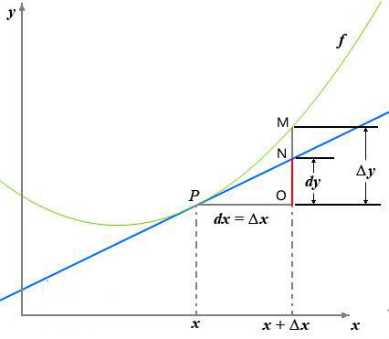
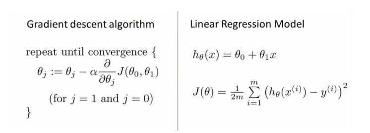

# 机器学习概念：梯度下降

### 0. 前言

机器学习中大部分都是**优化问题**，大多数的优化问题都可以使用梯度下降/上升法处理，所以，搞清楚梯度算法就非常重要

学习梯度，需要一定的数学知识：导数（Derivative）、偏导数（Partial derivative）和方向导数（Directional derivative）。

### 1. 导数

一张图看懂，导数与微分：

导数的定义如下：

$f'(x_0)=\underset{\Delta x\rightarrow0}{lim}\frac{\Delta y}{\Delta x}=\underset{\Delta x \rightarrow 0}{lim}\frac{f(x_0+\Delta x)-f(x_0)}{\Delta x}$

反应的是函数$y=f(x)$在某一点处沿$x$轴正方向的**变化率** 

函数$f(x)$在$x$轴上沿着$x$轴正方向的变化趋势，**导数的绝对值越大，变化趋势越明显**

- 如果导数值为正的话，说明$f(x)$在$x$点沿着$x$轴正方向是趋于增加的
- 如果导数值为负的话，说明$f(x)$在$x$点沿着$x$轴正方向是趋于减少的

##### 对于上式子

|     符号     |                    意义                    |
| :--------: | :--------------------------------------: |
| $\Delta x$ |                 $x$的变化量                  |
|    $dx$    |      $x$的变化量$\Delta x$趋于0时，记作微元$dx$      |
| $\Delta y$ | $\Delta y=f(x_0+\Delta x)-f(x_0)$指函数的改变量 |
|    $dy$    |          $dy=f'(x_0)dx$是切线的改变量           |

当$\Delta x \rightarrow 0$时，$dy$与$\Delta y$都是无穷小，$dy$是$\Delta y$的主部，即：$\Delta y=dy+o(\Delta x)$ $o()$：低阶无穷小

### 2. 偏导数

偏导数的定义如下：

$\frac{\partial}{\partial x_j}f(x_0,x_1,\cdots,x_n)=\underset{\Delta x \rightarrow 0}{lim}\frac{\Delta y}{\Delta x}=\underset{\Delta x \rightarrow 0}{lim}\frac{f(x_0,x_1,\cdots,x_n)-f(x_0,x_1,\cdots,x_n)}{\Delta x}$

可以看到，导数与偏导数的本质都是一样的，当自变量的变化量趋于0时，函数值的变化量与自变量变化量比值的极限。直观的说，偏导数也就是函数在某一点上沿坐标轴正方向的变化率。

**导数与偏导数的区别**

**导数**：指的是一元函数中，函数$y=f(x)$在某一点处沿$x$轴正方向的变化率

**偏导数**：指的是多元函数中，函数$y=f(x_1,x_2,\cdots,x_n)$在某一点处沿某一坐标轴$(x_1, x_2, \cdots, x_n)$正方向的变化率

### 3. 方向导数

方向导数的定义如下：

$\frac{\partial}{\partial l}f(x_0,x_1,\cdots,x_n)=\underset{\rho \rightarrow 0}{lim}\frac{\Delta y}{\Delta x}=\underset{\rho \rightarrow 0}{lim}\frac{f(x_0+\Delta x_0,\cdots,x_j +\Delta x_j,\cdots,x_n+\Delta x_n)-f(x_0,\cdots,x_j,\cdots,x_n)}{\rho}$

其中: $\rho = \sqrt{(\Delta x_0)^2+\cdots+(\Delta x_j)^2+\cdots+(\Delta x_n)^2}$

导数与偏导数均为沿坐标轴正方向讨论函数的变化率，而方向导数，顾名思义，讨论函数在任意方向的变化率。即：**某一点在某一趋近方向上的导数值**

通俗的解释是：

我们不仅要知道函数在坐标轴正方向上的变化率（即偏导数），而且还要设法求得函数在其它特定方向上的变化率，而方向导数就是函数在其它特定方向上的变化率。

### 4. 梯度

梯度的定义如下：

$gradf(x_0,x_1,\cdots,x_n)=(\frac{\partial f}{\partial x_0},\cdots,\frac{\partial f}{\partial x_j},\cdots,\frac{\partial f}{\partial x_n})$

梯度的存在，为了回答一个问题：

**函数在变量空间的某一点处，沿着哪一个方向有着最大的变化率**

梯度的文字定义如下：

**函数在某一点的梯度是这样一个向量，它的方向与取得最大方向导数的方向一致，它的模为方向导数的最大值。**

**注意**：

- 梯度是一个**向量**，有方向有大小
- 梯度的方向是**最大方向导数**的方向
- 梯度的值的最大方向导数的值

**梯度即函数在某一点最大的方向导数，函数沿梯度方向，函数的变化率最大。**

### 5. 梯度下降法

既然在变量空间的某一点处，函数沿梯度方向具有最大的变化率，那么在优化目标函数的时候，自然是沿着**负梯度方向**去减小函数值，来达到我们的优化目标

如何沿着负梯度方向减小函数值呢？因为梯度是偏导数的集合，如下：

$gradf(x_0,x_1,\cdots,x_n)=(\frac{\partial f}{\partial x_0},\cdots,\frac{\partial f}{\partial x_j},\cdots,\frac{\partial f}{\partial x_n})$

由于梯度和偏导数均为向量，由向量的运算法则可知，我们在每个变量轴上减小对应的变量值即可，梯度下降算法可描述为：

> Repeat {
>
> ​	$x_0:=x_0-\alpha\frac{\partial f}{\partial x_0}$
>
> ​	$\cdots$
>
> ​	$x_j:=x_j-\alpha\frac{\partial f}{\partial x_j}$
>
> ​	$\cdots$
>
> ​	$x_n:=x_n-\alpha\frac{\partial f}{\partial xn}$
>
> ​	$\cdots$
>
> }

由这个可以很清楚的了解梯度下降的过程，**类似人在高山上，如何快速下山**

1. 寻找下降速度最快的方向
2. 向下走
3. 循环步骤1和步骤2， 直到到达最小值（山底）

在这里，我们还需要了解几个概念：

#### 5.1. 步长(learning rate)(学习速度)

步长决定了在梯度下降过程中，每一步沿梯度负方向前进的长度。

#### 5.2. 特征(feature)

特征值的是样本输入部分，比如两个**单特征**样本$(x^{(0)}, y^{(0)}),(x^{(1)}, y^{(1)})$则第一个样本的特征为$x^{(0)}$,第一个样本的输出为$y^{(0)}$

#### 5.3. 假设函数(hypothesis function)

在监督学习中，为了拟合输入样本，而使用假设函数，记作$h_\theta(x)$.比如对于单个特征的m个样本$(x^{(i)}, y^{(i)}) (i=1,2,\cdots,m)$可以采用拟合函数如下：$h_\theta(x)=\theta_0+\theta_1 x$

#### 5.4. 损失函数(loss function)

为了评估模型拟合的好坏，通常损失函数来度量拟合的程度。损失函数极小化，意味着拟合程度最好，对应的模型参数即为最优参数。在线性回归中，损失函数通常为样本输出和假设函数的差取平方，比如对于m个样本$(x_i,y_i)(i=1,2,\cdots,m)$采用线性回归，损失函数为：

$J(\theta_0,\theta_1)=\frac{1}{2}\sum^{m}_{i=1}(h_\theta(x_i)-y_i)^2$ 这里的$\frac{1}{2}$是为了方便求导

其中$x_i$表示第$i$个样本特征，$y_i$表示第$i$个样本对于的输出,$h_\theta(x_i)$为假设函数。

#### 梯度下降算法与线性回归算法比较

#### 6. 梯度下降算法详细

梯度下降算法可以有代数法和矩阵法（也称向量法）

相比于代数法，矩阵法更加简洁，这里就不介绍代数法了，感兴趣的读者可以阅读：

[[梯度下降（Gradient Descent）小结]](https://www.cnblogs.com/pinard/p/5970503.html)

**梯度下降算法的矩阵法**

这里需要一定的矩阵 求导 知识

首先我们需要确定优化模型的假设函数和损失函数，对于线性回归来说：

**假设函数：**

 $h_\theta(x_1,x_2,x\cdots,x_n)=\theta_o+\theta_1x_1+\cdots+\theta_nx_n$

矩阵表达方式为:$h_\theta(\boldsymbol X)=\boldsymbol X\theta$

其中：$\boldsymbol X$是大小为$m$x$n$的矩阵。m代表样本个数, n代表样本的特征数

$h_\theta(\boldsymbol X)$为$m$x1的向量、$\theta$为$n$x1的向量

**损失函数：**

$J(\theta)=\frac{1}{2}(\boldsymbol X\theta-\boldsymbol Y)^T(\boldsymbol X\theta-Y)$

其中：$\frac{1}{2}$是为了方便求导，$\boldsymbol Y$是样本的输出向量，维度为$m$x1

**算法过程：**

> 1. 确定当前位置的损失函数的梯度，对于$\theta$向量，其梯度表达式如下：
>
>    $\frac{\partial}{\partial\theta}J(\theta)$
>
> 2.  用步长乘以损失函数的梯度，得到当前位置下降的距离
>
>    $\alpha \frac{\partial}{\partial\theta}J(\theta)$    这里设置$\alpha$为步长
>
> 3.  确定$\theta$向量里的每个值，梯度下降的距离都小于$\varepsilon$，如果梯度下降的距离小于$\varepsilon$则算法终止，当前$\theta$向量即为最终结果。否则进行下一步
>
> 4. ​ 更新$\theta$向量，更新表达式如下： 更新结束后，将表达式传回步骤1
>
>    $\theta=\theta-\alpha\frac{\partial}{\partial}J(\theta)$

其中，损失函数对于$\theta$向量的偏导数计算如下：

$\frac{\partial}{\partial\theta}J(\theta)=\boldsymbol X^T(\boldsymbol X\theta-\boldsymbol Y)$

步骤4中$\theta$向量的更新表达式如下：

$\theta=\theta-\alpha \boldsymbol X^T(\boldsymbol X\theta-\boldsymbol Y)$

#### 7. 梯度下降法大家族（BGD，SGD，MBGD）

##### 7.1. 批量梯度下降法（Batch Gradient Descent）

批量梯度下降法，是梯度下降法最常用的形式，具体做法也就是在更新参数时使用所有的样本来进行更新。

$\theta_i = \theta_i - \alpha\sum\limits_{j=0}^{m}(h_\theta(x_0^{(j)}, x_1^{(j)}, ...x_n^{(j)}) - y_j)x_i^{(j)}$

由于我们有m个样本，这里求梯度的时候就用了所有m个样本的梯度数据。

##### 7.2. 随机梯度下降法（Stochastic Gradient Descent）

随机梯度下降法，其实和批量梯度下降法原理类似，区别在与求梯度时没有用所有的m个样本的数据，而是仅仅选取一个样本j来求梯度。对应的更新公式是：

$\theta_i = \theta_i - \alpha (h_\theta(x_0^{(j)}, x_1^{(j)}, ...x_n^{(j)}) - y_j)x_i^{(j)}$

##### 7.3. 小批量梯度下降法（Mini-batch Gradient Descent）
小批量梯度下降法是批量梯度下降法和随机梯度下降法的折衷，也就是对于m个样本，我们采用x个样子来迭代，$1<x<m$。一般可以取x=10，当然根据样本的数据，可以调整这个x的值。对应的更新公式是：

$\theta_i = \theta_i - \alpha \sum\limits_{j=t}^{t+x-1}(h_\theta(x_0^{(j)}, x_1^{(j)}, ...x_n^{(j)}) - y_j)x_i^{(j)}$

#### 8. 梯度下降法和其他无约束优化算法的比较
　在机器学习中的无约束优化算法，除了梯度下降以外，还有前面提到的最小二乘法，此外还有牛顿法和拟牛顿法。

梯度下降法和最小二乘法相比，梯度下降法需要选择步长，而最小二乘法不需要。梯度下降法是迭代求解，最小二乘法是计算解析解。如果样本量不算很大，且存在解析解，最小二乘法比起梯度下降法要有优势，计算速度很快。但是如果样本量很大，用最小二乘法由于需要求一个超级大的逆矩阵，这时就很难或者很慢才能求解解析解了，使用迭代的梯度下降法比较有优势。

梯度下降法和牛顿法/拟牛顿法相比，两者都是迭代求解，不过梯度下降法是梯度求解，而牛顿法/拟牛顿法是用二阶的海森矩阵的逆矩阵或伪逆矩阵求解。相对而言，使用牛顿法/拟牛顿法收敛更快。但是每次迭代的时间比梯度下降法长。

参考: https://www.cnblogs.com/pinard/p/5970503.html