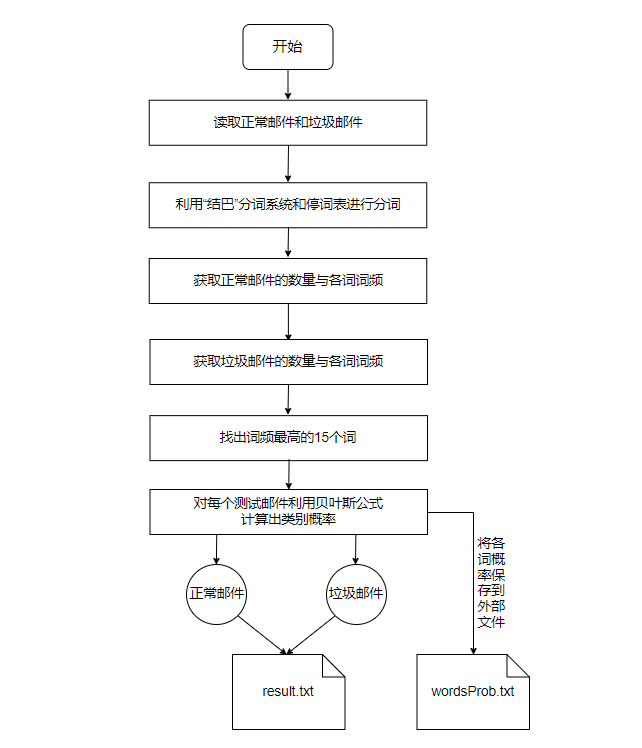

# Python-贝叶斯实战垃圾邮件过滤（大量数据）

### 环境

Python 3.6.2

jieba 0.39

### 数据

8000封邮件数据

- 正常邮件： 7063封
- 垃圾邮件： 7775封
- 测试邮件：392封（其中文件名低于1000的均为正常邮件）

### 流程图

此处将结果输出到result.txt文件中

各词概率保存到wordsProb.txt中

###Code: 

[Github](https://github.com/yingzk/MyML/tree/master/C-SpamClassifier)

